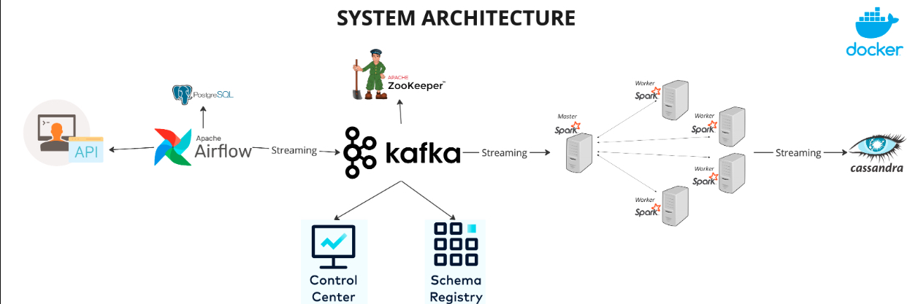

# System Architecture

This repository contains the system architecture design for a real-time data processing pipeline, visualized in the provided diagram. 

## Overview

The architecture demonstrates the integration of various technologies for real-time data ingestion, processing, and storage. Below is the breakdown of the components:

### Components:

1. **API**: Acts as the entry point for data ingestion.
2. **Apache Airflow**: Orchestrates workflows and ensures smooth data pipeline execution.
3. **Kafka**: Handles real-time streaming data with high throughput and reliability.
   - Integrated with **Schema Registry** for managing Avro schemas.
   - Includes a **Control Center** for monitoring and managing Kafka clusters.
4. **ZooKeeper**: Manages and coordinates the Kafka brokers.
5. **Apache Spark**: Processes streaming data for real-time analytics.
   - Consists of a Master node and Worker nodes.
6. **Cassandra**: Stores processed data for high availability and scalability.
7. **Docker**: Containerizes the architecture to ensure consistent deployment across environments.
8. **PostgreSQL**: Used as a backend for Apache Airflow metadata.

### Data Flow:

- Data enters through the API and is orchestrated by Apache Airflow.
- Airflow streams data into Kafka, which distributes it across the system.
- Kafka brokers, managed by ZooKeeper, feed data into Spark for processing.
- The processed data is stored in Cassandra for querying and analytics.
- The architecture is containerized using Docker for seamless deployment.

## Getting Started

1. **Prerequisites**:
   - Docker and Docker Compose
   - Apache Kafka
   - Apache Airflow
   - Cassandra
   - PostgreSQL
   - Apache Spark

2. **Deployment**:
   - Clone the repository.
   - Use Docker Compose to bring up all components:
     ```bash
     docker-compose up
     ```

3. **Usage**:
   - Access the Kafka Control Center to monitor Kafka.
   - Use Apache Airflow to trigger and monitor workflows.
   - Query data from Cassandra for insights.

## Diagram



